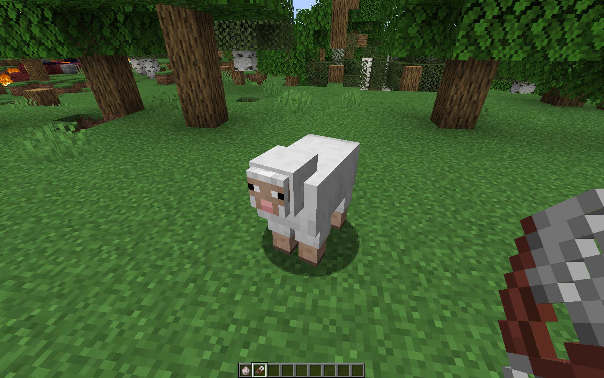
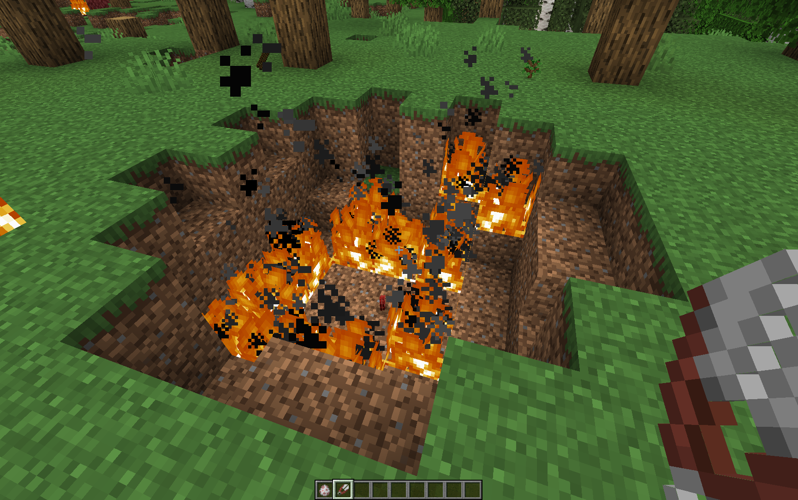

# Sheep Terrorist - exploding sheeps after shreading
A plugin for Minecraft server that adds an explosion after sheep shearing.

## Configuration file:
explosionPower - power of explosion, default 4 (TNT)
explosionFire - if true explosion with fire
explosionChance - chance for explosion after sheep shearing

## Use:

## PL
Plugin do serwera Minecraft dodający eksplozję po ostrzyżeniu owiec.
